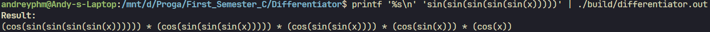
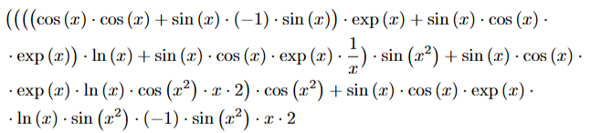
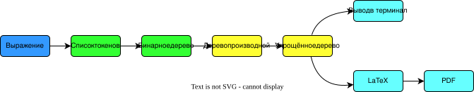
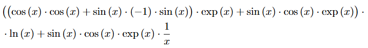
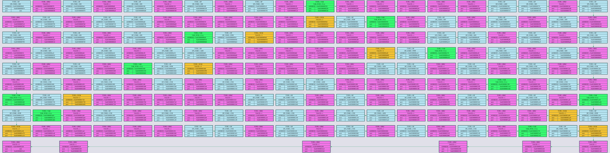
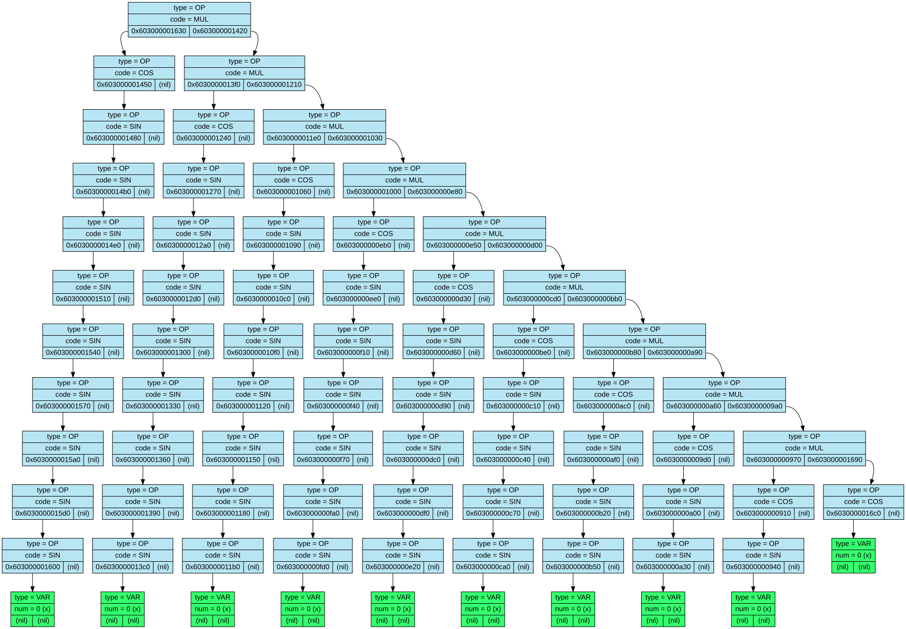

# Differentiator

**Differentiator** - учебная программа для дифференцирования математических выражений. Она разбирает выражение методом рекурсивного спуска, строит бинарное дерево, создаёт дерево производной, упрощает его и выводит результат в PDF с использованием LaTeX или в консоль.

> [!NOTE]
> Проект предназначен для платформы **Linux**.

## Содержание

- [Примеры вывода](#примеры-вывода)
  - [Вывод в консоль](#вывод-в-консоль)
  - [Вывод в PDF](#вывод-в-pdf)
- [Поддерживаемые выражения](#поддерживаемые-выражения)
- [Сборка](#сборка)
  - [Требования](#требования)
- [Использование](#использование)
  - [Терминал → терминал](#терминал--терминал)
  - [Файл → терминал](#файл--терминал)
  - [Терминал → PDF](#терминал--pdf)
  - [Файл → PDF](#файл--pdf)
- [Возможности](#возможности)
- [Этапы перевода](#этапы-перевода)
  - [Токенизация](#токенизация)
  - [Рекурсивный спуск](#рекурсивный-спуск)
  - [Дифференцирование](#дифференцирование)
  - [Упрощение](#упрощение)
  - [Перенос длинных выражений](#перенос-длинных-выражений)
- [Графические дампы](#графические-дампы)
  - [Список токенов](#список-токенов)
  - [Дерево производной](#дерево-производной)
- [Структура проекта](#структура-проекта)
- [Ограничения](#ограничения)

## Примеры вывода

### Вывод в консоль

<p align="center">
  
</p>

### Вывод в PDF

<p align="center">
  
</p>

## Поддерживаемые выражения

| Категория | Синтаксис |
|---|---|
| Сложение | `x + y` |
| Вычитание | `x - y` |
| Умножение | `x * y` |
| Деление | `x / y` |
| Степень | `x ^ y` |
| Натуральный логарифм | `ln(x)` |
| Синус | `sin(x)` |
| Косинус | `cos(x)` |
| Экспонента | `exp(x)` |

Допускаются пробелы, имена переменных из латинских букв, целые и дробные числа. Дробная часть отделяется точкой: 0.5, 12.75. Записи с запятой (0,5), без целой части (.5) и в экспоненциальной форме (1e-3) не поддерживаются.
Унарный минус во входном выражении не поддерживается; отрицание можно записать как `0 - x`.

Пример входного выражения:

```text
sin(x^2 + 1.7) * exp(0 - x) / (x^3 + 2.5)
```

## Сборка

### Требования

- Linux;
- `g++` с поддержкой C++17;
- GNU Make;
- Graphviz (`dot`) для SVG-дампов;
- `pdflatex` и пакет `amsmath` для создания PDF.

В Ubuntu/Debian зависимости можно установить так:

```bash
sudo apt update
sudo apt install build-essential graphviz texlive-latex-base
```

Клонирование и сборка:

```bash
git clone https://github.com/andreyphm/differentiator.git
cd differentiator
make
```

Исполняемый файл будет создан по пути:

```text
build/differentiator.out
```

По умолчанию включены AddressSanitizer, UndefinedBehaviorSanitizer и дополнительные проверки. Собрать проект без санитайзеров можно так:

```bash
make SANITIZER_FLAGS=
```

## Использование

Общий формат запуска:

```bash
./build/differentiator.out [-i input_file] [-o output.pdf]
```

Оба параметра необязательны и могут быть указаны в любом порядке:

- `-i input_file` - прочитать выражение из файла;
- `-o output.pdf` - сохранить результат в PDF.

Без `-i` программа читает выражение из стандартного ввода. Без `-o` производная печатается в терминал.

### Терминал → терминал

Запустите программу и введите выражение:

```bash
./build/differentiator.out
```

Выражение также можно передать через конвейер:

```bash
printf 'sin(x^2 + 1) * exp(x) / (x^3 + 2)\n' | ./build/differentiator.out
```

### Файл → терминал

```bash
./build/differentiator.out -i input.txt
```

### Терминал → PDF

```bash
./build/differentiator.out -o output.pdf
```

Введите выражение после запуска. Результат будет записан в PDF.

### Файл → PDF

```bash
./build/differentiator.out -i input.txt -o output.pdf
```

Имя выходного файла должно оканчиваться на `.pdf` без учёта регистра.

Для компиляции программа:

1. создаёт каталог `temp`, если он отсутствует;
2. записывает выражение в `temp/output.tex`;
3. запускает `pdflatex` в дочернем процессе;
4. проверяет код его завершения;
5. копирует `temp/output.pdf` в указанный пользователем файл.

Временные `.tex`, `.aux`, `.log` и `.pdf` остаются в каталоге `temp` для диагностики.

## Возможности

- построение бинарного дерева выражения с учётом приоритетов операций;
- дифференцирование арифметических выражений;
- упрощение бинарного дерева (свёртка константных выражений, удаление нейтральных элементов);
- вывод результата строкой в терминале;
- генерация PDF файла с результатом с помощью LaTeX;
- автоматический перенос длинных выражений в PDF.

## Этапы перевода

<p align="center">
  
</p>

### Токенизация

Исходная строка преобразуется в двусвязный список токенов. Токен хранит тип и соответствующее значение: число, номер переменной, код операции или специальный символ.

### Рекурсивный спуск

Парсер преобразует список токенов в бинарное дерево с помощью алгоритма рекурсивного спуска.

### Дифференцирование

Для каждого вида операции реализовано отдельное правило. Например:

```text
(f + g)' = f' + g'
(f * g)' = f' * g + f * g'
(f / g)' = (f' * g - f * g') / g^2
(sin(f))' = cos(f) * f'
(ln(f))' = f' / f
```

Поддерживается и общий случай степени `f(x)^g(x)`.

### Упрощение

Упрощение запускается повторно, пока очередной проход изменяет дерево. Реализованы, в частности:

- вычисление арифметических операций над двумя числами;
- `x * 0 → 0` и `0 * x → 0`;
- `x * 1 → x` и `1 * x → x`;
- `x + 0 → x` и `0 + x → x`;
- `x - 0 → x` и `0 - x → -1 * x`;
- `0 / x → 0`;
- `x^1 → x`.

### Перенос длинных выражений

В терминале производная печатается целиком: при необходимости её переносит сам терминал. При создании PDF программа оценивает длину формулы и переносит её по знакам операций. Знак дублируется в конце предыдущей и в начале следующей строки:

<p align="center">
  
</p>

## Графические дампы

Во время обработки автоматически создаются два SVG-дампа.

### Список токенов

Токены располагаются змейкой в порядке чтения выражения. Цвет узла показывает его тип, а поля содержат значение, адрес и связи `next`/`prev`.

<details>
  <summary><b>Открыть дамп списка токенов</b></summary>
  <br>
  <a href="source/list_dump/list_dump.svg">
    
  </a>
</details>

### Дерево производной

Дамп показывает упрощённое дерево производной. Цветом различаются операции, переменные и числа; рёбра отображают левое и правое поддеревья.

<details open>
  <summary><b>Открыть дамп дерева производной</b></summary>
  <br>
  <a href="source/tree_dump/tree_dump.svg">
    
  </a>
</details>

## Структура проекта

```text
differentiator/
├── headers/
│   ├── differentiator.h  # узлы дерева, операции и публичный интерфейс
│   ├── tokenization.h    # токены и двусвязный список
│   ├── parser.h          # точка входа рекурсивного спуска
│   ├── input.h           # аргументы и пользовательский ввод
│   ├── output.h          # консольный и PDF-вывод
│   ├── dump.h            # пути и интерфейс дампов
│   └── macros.h          # сокращения для построения деревьев
├── source/
│   ├── tokenization.c    # лексический анализ
│   ├── parser.c          # построение дерева
│   ├── differentiator.c  # правила дифференцирования
│   ├── simplifier.c      # алгебраические упрощения
│   ├── input.c           # разбор аргументов, чтение файла и stdin
│   ├── output.c          # терминал, LaTeX и PDF
│   ├── list_dump/        # дамп списка токенов
│   └── tree_dump/        # дамп дерева
└── Makefile
```

## Ограничения

- Поддерживается только Linux.
- Переменная дифференцирования отдельно не выбирается: производная каждой встреченной переменной считается равной `1`.
- Поддерживается не более 20 различных переменных в одном выражении.
- Имена переменных состоят только из латинских букв.
- Набор упрощений ограничен локальными преобразованиями и не приводит выражение к единственной канонической форме.
